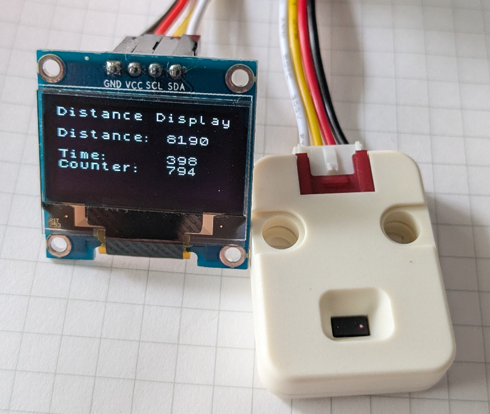

# Embedded Rust and Embassy and a display

I was looking for a ready-to-use [Embassy](https://embassy.dev/) example using a SSD1306 via I2C on a RP2040. Could not find one, so I created this repo.

## Hardware Requirements

* RP2040
* RPi Pico Probe (for downloading and status messages from the RP2040)
* I2C SSD1306 OLED display (128x64 pixel)
* VL53L0X as a distance measuring sensor

## Software Requirements

* Install target compiler:

```
$ rustup target add thumbv6m-none-eabi
```

* To use the Pico probe:

```
$ cargo binstall probe-rs
```

* To use various tools, e.g. to see the code size of the generated ELF (e.g. `cargo size`):

```
$ cargo binstall cargo-binutils
$ cargo size
    Finished `dev` profile [optimized + debuginfo] target(s) in 0.05s
   text    data     bss     dec     hex filename
  42356       0  103960  146316   23b8c rp-ssd1306
```

## Running it

The OLED is connected to I2C0 (GPIO 4 and 5). The VL53L0X is connected to I2C1 (GPIO 2 and 3).

```
$ cargo run --release
    Finished `release` profile [optimized + debuginfo] target(s) in 0.05s
     Running `probe-rs run --chip RP2040 --protocol swd target/thumbv6m-none-eabi/release/rp-ssd1306`
      Erasing ✔ [00:00:00] [###############################################] 36.00 KiB/36.00 KiB @ 48.32 KiB/s (eta 0s )
  Programming ✔ [00:00:01] [###############################################] 36.00 KiB/36.00 KiB @ 18.73 KiB/s (eta 0s )    Finished in 2.738s
INFO  Hello from core 0
└─ rp_ssd1306::__core0_task_task::{async_fn#0} @ src/main.rs:74  
INFO  Hello from core 1
└─ rp_ssd1306::__core1_task_task::{async_fn#0} @ src/main.rs:96
```

Use ^C to stop, but the program will continue to run on the RPi Pico.


